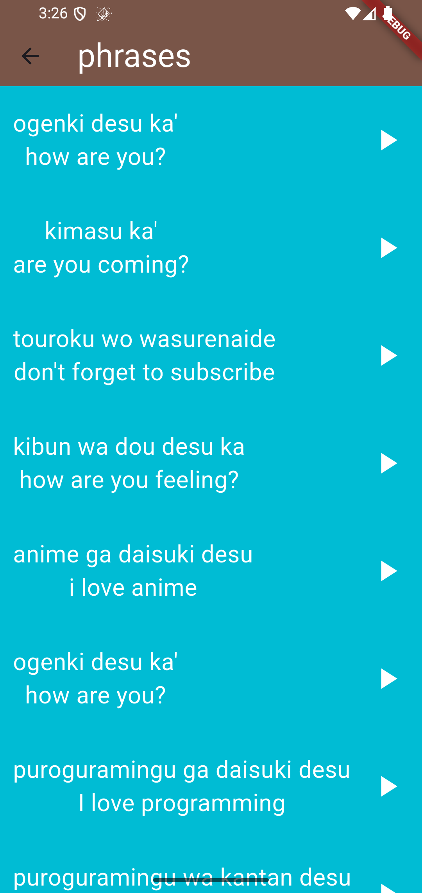
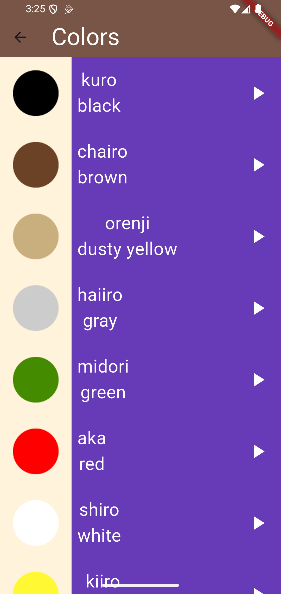

 🇯🇵 Japanese Learning App

A beautiful and interactive Flutter application designed to help beginners learn basic Japanese vocabulary through different categories.


---

## 📱 About

This app provides an easy and fun way to learn Japanese basics including numbers, family members, colors, and common phrases. Each word includes:
- Japanese characters (Kanji/Hiragana/Katakana)
- Romanized pronunciation (Romaji)
- English translation
- Interactive UI with audio support (coming soon)

---

## ✨ Features

- 🔢 **Numbers (1-10)** - Learn basic Japanese counting
- 👨‍👩‍👧‍👦 **Family Members** - Essential family vocabulary
- 🎨 **Colors** - Common color names in Japanese
- 💬 **Phrases** - Useful everyday expressions and greetings
- 🎯 **Clean UI** - Simple and intuitive interface
- 📱 **Organized Categories** - Easy navigation between topics

---

## 📸 Screenshots


<p float="left">
  
  
  
  
  
</p>

---

## 🛠️ Built With

- **Flutter** - UI Framework
- **Dart** - Programming Language
- Clean Architecture principles
- Reusable widget components

---

## 📂 Project Structure
```
lib/
├── components/        # Reusable UI components
│   ├── category_item.dart
│   └── item.dart
├── models/           # Data models
│   └── number.dart
├── screens/          # App screens
│   ├── home_page.dart
│   ├── numbers_page.dart
│   ├── family_members_page.dart
│   ├── colors_page.dart
│   └── phrases_page.dart
└── main.dart         # App entry point
```
